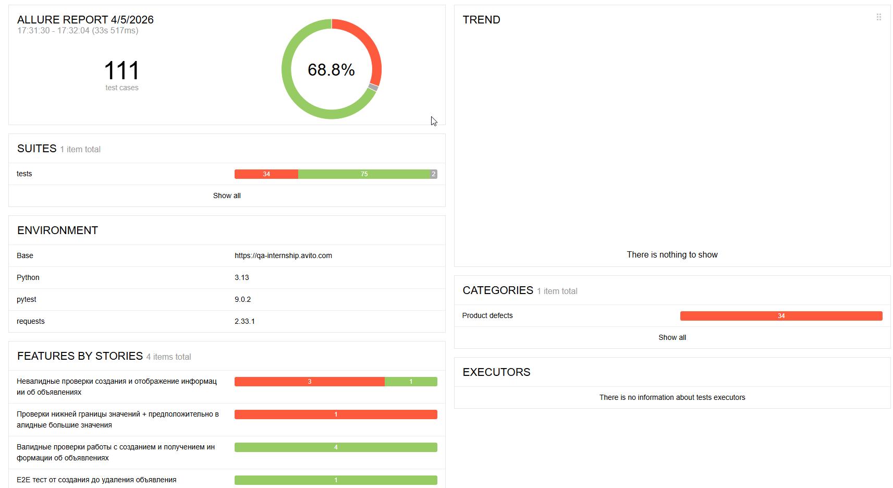
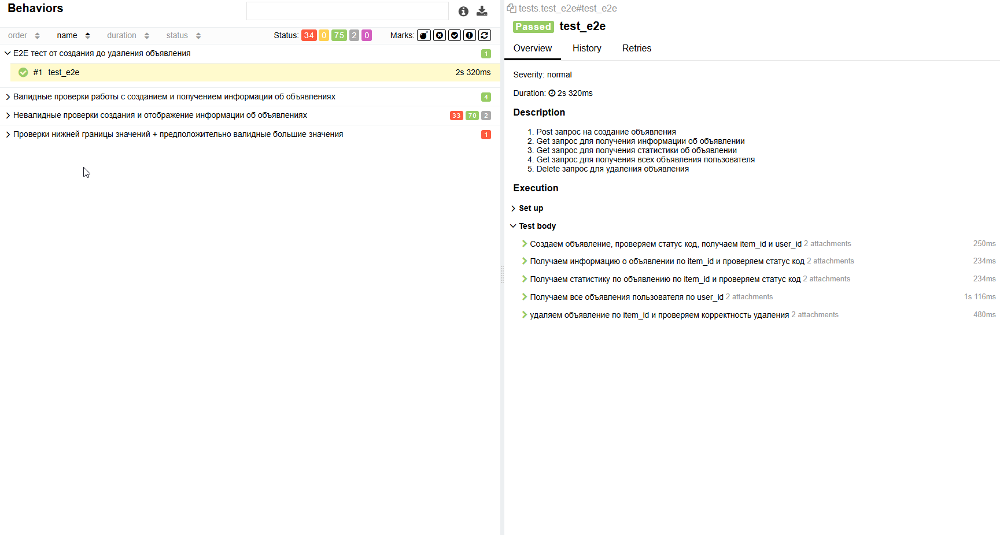

# Тестовое задание QA-trainee-assignment-spring-2026

+ Задание 1. Содержит список багов найденных на скриншоте и их приоритет
+ Задание 2.1. Содержит автотесты для API микросервиса объявлений

Тестируется микросервис объявлений со следующими эндпоинтами:
+ POST /api/1/item — создание объявления
+ GET /api/1/item/{id} — получение объявления
+ GET /api/1/{sellerID}/item — список объявлений пользователя
+ GET /api/2/statistic/{id} — статистика объявления

Набор автотестов на Python (pytest + requests) для проверки API микросервиса.  
- Покрыты позитивные, негативные и граничные сценарии, создан отчет Allure, использованы форматтер black и линтер flake8. 
- Найденные дефекты — в [`BUGS.md`](BUGS.md).

# Структура проекта:

```text
test_project/
├── api/
│   └── main_class.py      # Обертка над requests
├── tests/
│   ├── test_valid.py      # Валидные тесты
│   ├── test_invalid.py    # Негативные тесты
│   ├── test_e2e.py        # e2e тест
├── data/
│   └── payloads.py        # Тестовые данные
├── conftest.py            # Фикстуры pytest
├── requirements.txt       # Зависимости
├── pytest.ini             # Настройки pytest
├── setup.cfg              # Конфиг flake8
├── TESTCASES.md           # Описание тест-кейсов
├── BUGS.md                # Найденные дефекты
├── README.md              # Документация
├── docs                   # Скриншоты отчёта Allure
└── Task1_Bugs             # Задание 1 (баги на скриншоте)
```

## Запуск тестов:

1. Создайте клон репозитория с тестовым заданием с помощью команды в терминале
```bash
git clone https://github.com/neeeyy/test_project_QA.git
```
2. Проверка установленного Python
```
Откройте терминал - Командную строку в Windows или Terminal в macOS/Linux и выполните:
```
```bash
python --version
```
```
Если python не установлен - скачайте его с python.org и установите.
```
3. Перейдите в папку с проектом:
```bash
cd путь/к/папке/test_project
```
+ Пример для Windows:
```bash
cd C:\Users\YourName\Downloads\avito-test-task
```
+ Пример для macOS/Linux:
```bash
cd ~/Downloads/avito-test-task
```
4. Создайте и активируйте виртуальное окружение:
+ Windows:
```bash
python -m venv .venv
.venv\Scripts\activate
```
+ macOS/Linux:
```bash
python3 -m venv .venv
source .venv/bin/activate
```
5. Установить зависимости
```bash
pip install -r requirements.txt
```
```
Если вы увидите Successfully installed ... - зависимости установлены!
```
6. Запустите тесты. Для запуска все тестов используйте:
```bash
pytest -v
```

## Для запуска тестов по маркерам используйте:

```bash
pytest -v -m invalid_posts_values          # Невалидные значения в payload для POST
pytest -v -m invalid_posts                 # Негативные тесты: отсутствующие обязательные поля
pytest -v -m invalid_get_item_400          # Невалидный item_id → Bad Request (400)
pytest -v -m invalid_get_item_404          # Невалидный item_id → Not Found (404)
pytest -v -m invalid_get_item_statistics   # Невалидная проверка статистики объявления
pytest -v -m invalid_get_user_items        # Невалидный seller_id для получения всех items
pytest -v -m valid_create_item_post        # Успешное создание объявления
pytest -v -m valid_get_item_by_id          # Получение объявления по item_id
pytest -v -m valid_get_items_by_user       # Получение всех объявлений пользователя
pytest -v -m valid_get_item_statistics     # Получение статистики по item_id
pytest -v -m valid_post_any_value          # Тесты с экстремальными (min/max) значениями
```

## Для запуск тестов по файлам используйте:

```bash
pytest -v tests/test_valid.py           # Запуск только валидных тестов
pytest -v tests/test_invalid.py         # Запуск только невалидных тестов
pytest -v tests/test_e2e.py             # Запуск e2e теста
```

## Для запуска тестов с сохранением отчёта Allure используйте:

```bash
# Сгенерировать отчёт:
pytest tests --alluredir=allure-results
# Открыть в браузере:
allure serve allure-results
```

## В проекте использовались линтер flake8 и форматтер black:

Конфигурации:
+ flake8: setup.cfg (max-line-length = 88, exclude = .venv,__pycache__,data, ignore = W503)
+ black: дефолтные настройки
### Для их запуска:
```bash
flake8 .         # Проверка стиля
black --check .  # Проверка форматирования
black .          # Отформатировать автоматически
```

## Тест-кейсы:

Полное описание ручных тест-кейсов - в файле [TESTCASES.md](TESTCASES.md).

## Баг-репорты:

Найденные баги с описанием дефектов с шагами воспроизведения, окружением и оценкой серьёзности в файле [BUGS.md](BUGS.md).

## Ограничения:

+ Некоторые тесты падают ожидаемо из-за дефектов в тестируемом API. Все падения задокументированы в BUGS.md.
+ Несоответствие кодов в ответах - эндпоинты /api/1/item/:id и /api/2/statistic/:id 
возвращают 404 в HTTP-статусе, но 400 в теле ответа.
+ Тесты адаптированы под фактическое поведение сервиса.

## Пример отчёта Allure

В проекте использован Allure для визуализации результатов тестирования.
Ниже приведен пример отчёта:

